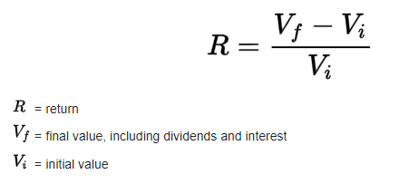
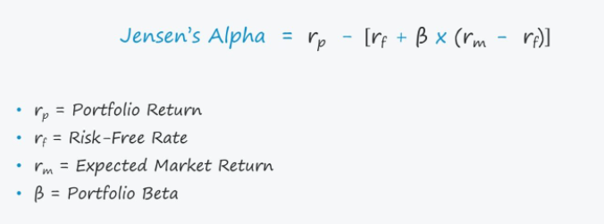
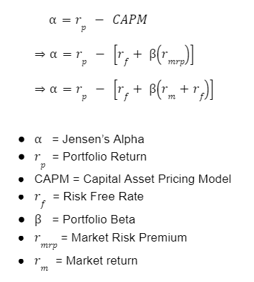
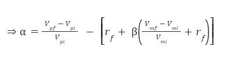

## **Lesson Plan: Finding Alpha**

---
### Prerequisite Python Libraries
1. [Pandas](https://pandas.pydata.org/)

2. [yFinance](https://pypi.org/project/yfinance/)

3. [getFamaFrenchFactors](https://pypi.org/project/getFamaFrenchFactors/)

4. [statsmodels](https://www.statsmodels.org/stable/index.html)

---
### Overview

This lesson will cover how financial analysts, and other finance professionals including portfolio managers, measure the risk-adjusted performance of their fund's ability to generate an abnormal return, or alpha.

---
### Objectives
By the end of this lesson, you will be able to:

1. Define the Jensen Measure and interpret its results

2. Explain how and why Jensen Alpha is used to measure fund performance

3. Pythonically compare a portfolio's performance to a benchmark

---
### **1. What Is the Jensen's Measure?**

 
The focus of this lesson is to meausure the performance of a single investment or portfolio against a benchmark. The financial calculations described in this lesson can also be used to measure a fund manager's performance against returns from a market-related investment (i.e. a mutal fund performance compared to the S&P 500).

 
But first, let's begin by setting up the scenario:

>You have just created an `optimized portfolio` of securities by picking stocks that are `noncorrelated`, or `minimally-correlated`, and offer the highest `Sharpe ratios`.

 
<b>Question:</b> How would you describe this in layman's terms?
 

    
<b>Answer:</b> (<i>click to expand</i>)
 
    In other words, you have created a portfolio of assets <i>(stocks)</i> by selecting <code>diversified</code> assets where the price movement of each asset either is not related, or minimally related to the price movement of another asset, and then further filtering to find assets with the highest returns after adjusting for each asset's volatility, which is a <code>risk-adjusted return</code>. <b>This effectively minimizes the overall volatility of the portfolio, while maximizing the return-to-risk ratio, thus creating an <code>optimized portfolio</code>.</b>

 

---
Continuing in our scenario:

>Let's say a year has past and your optimized portfolio has seen some healthy gains and accumulated some profit, but so has the overall market. In fact you recall reading a market analysis report on MorningStar calling this year "One of the greatest bull-run years in history" **Now you begin to wonder: "Are my returns better than the market's?"** 

* Naturally, you may start by simply comparing your portfolio's return to the return of the market using the simple return formula below to calculate the corresponding returns. But recall, you have worked so hard to create an optimized portfolio that maximizes the return-to-risk ratio. And yet, using the simple return formula you have ignored risk.

    * What if your portfolio is comprised of relatively riskier securities than your benchmark?

    * How would you know the required return you need to satisfy the extra risk you took on?

    

* <u>**The Jensen's measure**</u>, 
or `Jensen's alpha`, is a risk-adjusted performance measure that quantifies the excess returns obtained by a portfolio or investment, above or below the returns implied by the capital asset pricing model (CAPM), given the portfolio's or investment's beta and the average market return.

* This metric is also commonly referred to as simply `alpha`.

* Jensen’s alpha focuses only on non-diversifiable, relevant risk by using beta and CAPM. It assumes that the portfolio has been adequately diversified.

* The Jensen's alpha can be calculated using the following formula:

    

    Jensen's Alpha equals the portfolio return minus the capital asset pricing model (CAPM) which is the product of the portfolio beta and the market premium, plus the risk free rate.

    

* The formula can be applied to any type of asset including securities, bonds, stocks and derivatives.

* It can also be used to measure a fund manager's performance against returns from a market-related investment. For example, a mutal fund's performance compared to the S&P 500.
---

 
<b>Question:</b> Why is simply calculating the portfolio's return not sufficient in determining performance?

    
<b>Answer:</b> (<i>click to expand</i>)
 
In short, simple return does not account for risk. To accurately evaluate the performance of a portfolio, or an investment manager, an investor must consider the <code>overall return</code> of the portfolio <u>as well as</u> <code> portfolio risk</code> to see if the portfolio is earning the proper return for the level of risk it takes. For example, if two hedge-fund funds both have a 20% return, a <code>rational investor</code> should prefer the less risky fund.

 

---
### **2. Interpreting Jensen’s Alpha**

Now that you are able to calculate Jensen’s Alpha let's examine the results

* Jensen's alphas are reported in percentage format

* The value of alpha can range from:

    * **Positive Alpha:** Outperformed the benchmark on a risk-adjusted basis

    * **Negative Alpha:** Underperformed the benchmark on a risk-adjusted basis

    * **Zero Alpha:** Netural Performance (i.e. Tracks benchmark)

* The size of the value identifies the amount the portfolio over-or-under-performed the market on a risk-adjusted basis.

---

 
<b>Question:</b> What does it mean if the value of alpha is positive?

    
<b>Answer:</b> (<i>click to expand</i>)
 
If the value is positive, then the investment/portfolio is earning excess returns. In other words, a positive value for Jensen's alpha means a fund manager has <code>"beat the market"</code> with their stock-picking skills.

 

---
### **3. Activity**

**Corresponding Activity:** [01-Stu_Finding_Alpha](Activities/01-Stu_Finding_alpha)

In this activity, you will apply the concept of Jensen's Alpha to determine if 

to diversify a portfolio, a practical financial use case. In order to create a diversified portfolio that tends to minimize long-term volatility and risk, stocks within the portfolio should be as non-correlated as possible. Students need to find the stock with returns that are least correlated to the returns of stocks in an existing portfolio.

**File:** [market_analysis.ipynb](Activities/02-Stu_Correlation/Unsolved/diversification.ipynb)

**Instructions:** [README.md](Activities/02-Stu_Correlation/README.md)